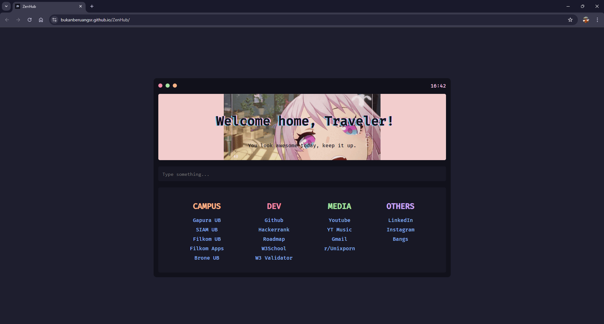
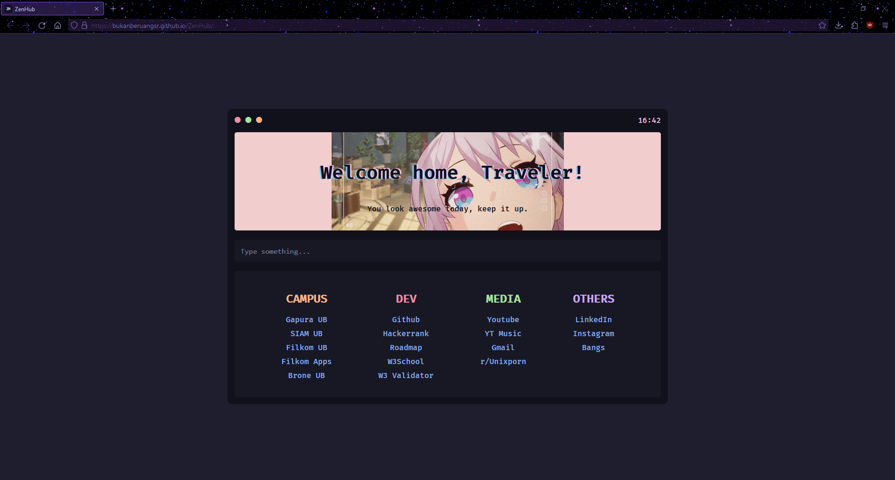

<h1 align="center"> ZenHub</h1>

## About

ZenHub is a custom startpage for web browsers designed to be as simple and as straightforward as possible. ZenHub is supported on multiple web browsers such as **Google Chrome** and **Mozilla Firefox**. I made this because I'm tired of seeing my browser default startpage.

## Showcase

Chrome or Chromium Based Browsers

Firefox or Firefox Based Browsers

